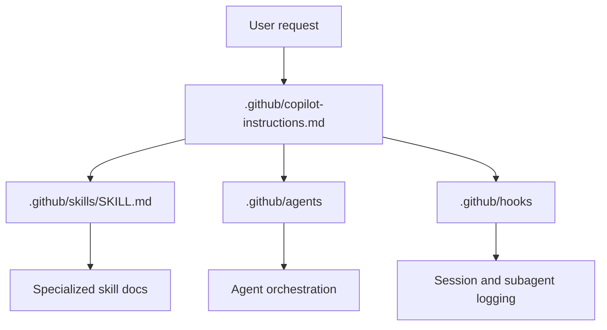
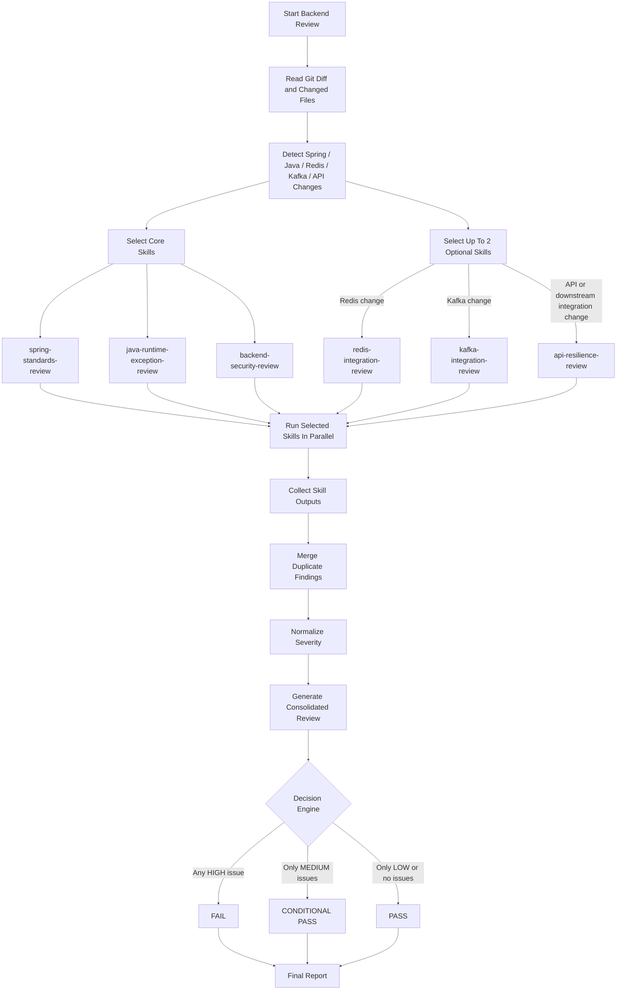
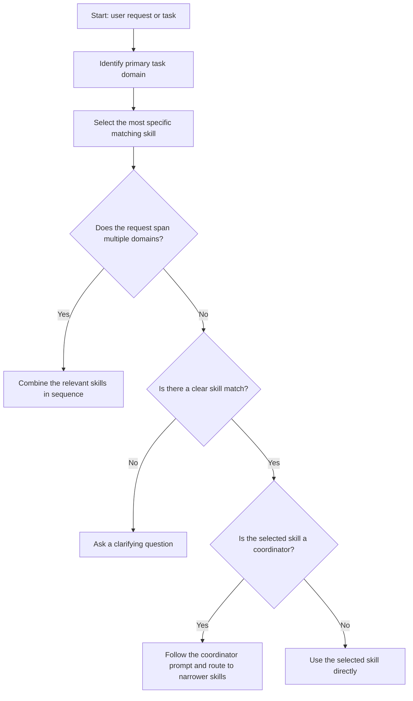
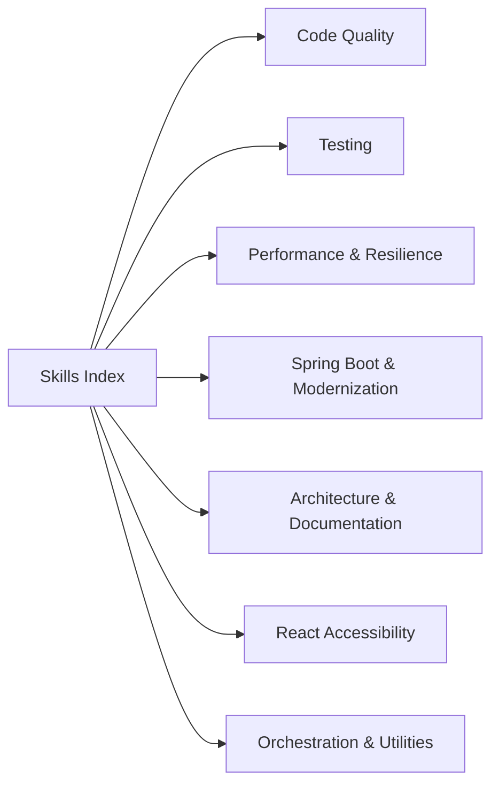
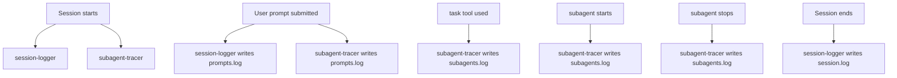

# Copilot Ecosystem Overview

This document summarizes the repository's Copilot entry point, agents, skills, and hooks in one place.

## At A Glance

## Entry Points

- `.github/copilot-instructions.md` is the top-level instruction file for Spring Boot work in this repository.
- `.github/skills/SKILL.md` is the master skill index.
- `.github/agents/backend-code-review-orchestrator.md` is the main agent currently defined in this repo.
- `.github/hooks/session-logger/` and `.github/hooks/subagent-tracer/` define the hook pipelines.

## Agents

### `backend-code-review-orchestrator`

Purpose: orchestrate backend code review for Java, Spring Boot, Redis, Kafka, and backend API resilience.

Flow diagram source:

- [`.github/agents/flow-diagram.md`](/Users/maheswarbuddolla/softwares/skills3/.github/agents/flow-diagram.md)

Skill-aware backend review flow:

Reference:
- [`.github/agents/backend-code-review-orchestrator.md`](/Users/maheswarbuddolla/softwares/skills3/.github/agents/backend-code-review-orchestrator.md)

## Skills

### Skill Selection Flow

### Skill Catalog

#### Code Quality & Standards

- `code-review-skill`
- `code-review-null-pointer-check`
- `code-review-exception-analysis`
- `code-review-code-quality`
- `java-code-quality-analyzer`
- `java-code-quality-correctness`
- `java-code-quality-security`
- `java-code-quality-performance`
- `java-code-quality-design`
- `secrets-management-checker`
- `java-docs`
- `sql-code-review`
- `jpa-jdbc-performance-optimizer`
- `query-optimizer`
- `sql-optimization`
- `stored-procedure-function-explainer`
- `projection-creation`
- `yaml-validator`

#### Testing

- `unit-test-generator`
- `java-junit`
- `integration-test-builder`
- `spring-boot-testing`
- `javascript-typescript-jest`
- `react-test-generator`
- `test-coverage-analyzer`
- `threading-async-analyzer`

#### Performance & Resilience

- `performance-profiler`
- `resilience-patterns-enforcer`
- `event-driven-architecture`
- `java-add-graalvm-native-image-support`

#### Spring Boot & Modernization

- `spring-3x-to-4x-modernization`
- `java-springboot`
- `create-spring-boot-java-project`
- `springboot-exception-orchestrator`
- `openapi-swagger-generator`
- `feature-flag-manager`
- `logging-observability-enhancer`

#### Architecture & Documentation

- `architecture-doc-generator`
- `architecture-doc-architecture`
- `architecture-doc-adr`
- `create-readme`
- `create-specification`
- `create-technical-spike`
- `engineering-design-agent`
- `engineering-design-intake`
- `engineering-design-scope`
- `engineering-design-planning`
- `engineering-design-validation`
- `engineering-design-architecture`
- `fullstack-project-architecture-analyzer`
- `fullstack-architecture-intake`
- `fullstack-architecture-hld`
- `fullstack-architecture-lld`
- `fullstack-architecture-external-apis`
- `fullstack-architecture-full-doc`
- `acquire-codebase-knowledge`

#### React Accessibility

- `react-ada-analysis`
- `ada-report-codebase-auditor`
- `react-redux-axios-css-javascript`
- `react-redux-axios-css-typescript`

#### Orchestration and Utilities

- `make-skill-template`
- `skill-usage-logger`

### Skill Index Diagram

Reference:
- [`.github/skills/SKILL.md`](/Users/maheswarbuddolla/softwares/skills3/.github/skills/SKILL.md)

## Hooks

### Session Logger

Location: `.github/hooks/session-logger/`

Purpose: log session lifecycle and prompt activity for audit and analytics.

Events:

- `sessionStart` -> `log-session-start.sh`
- `sessionEnd` -> `log-session-end.sh`
- `userPromptSubmitted` -> `log-prompt.sh`
- `skillUsed` -> `skill-usage-logger.sh`

Output files:

- `logs/copilot/session.log`
- `logs/copilot/prompts.log`
- `logs/copilot/skills.log`

### Subagent Tracer

Location: `.github/hooks/subagent-tracer/`

Purpose: track orchestrator delegation and subagent lifecycle events.

Events:

- `sessionStart` -> `log-session-start.sh`
- `userPromptSubmitted` -> `log-user-prompt.sh`
- `postToolUse` -> `log-task.sh`
- `subagentStart` -> `log-subagent-start.sh`
- `subagentStop` -> `log-subagent-stop.sh`

Output files:

- `logs/copilot/session.log`
- `logs/copilot/prompts.log`
- `logs/copilot/subagents.log`
- `logs/copilot/subagent-counts/*.count`

### Hook Flow Diagram

Reference:
- [`.github/hooks/session-logger/README.md`](/Users/maheswarbuddolla/softwares/skills3/.github/hooks/session-logger/README.md)
- [`.github/hooks/subagent-tracer/README.md`](/Users/maheswarbuddolla/softwares/skills3/.github/hooks/subagent-tracer/README.md)

## Reading Order

1. Read `.github/copilot-instructions.md` for repository-wide Spring Boot guidance.
2. Read `.github/skills/SKILL.md` to choose the right skill.
3. Read the relevant skill `SKILL.md` file for the specific task.
4. Read the agent file when backend review orchestration is needed.
5. Read the hook README and scripts when you need logging or tracing behavior.
