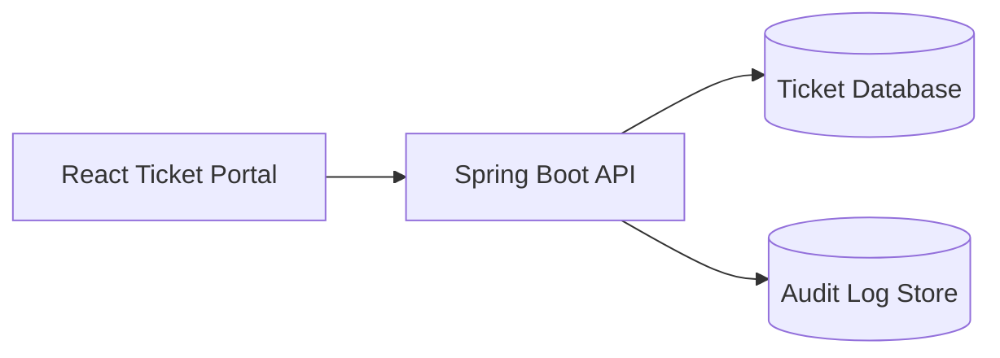
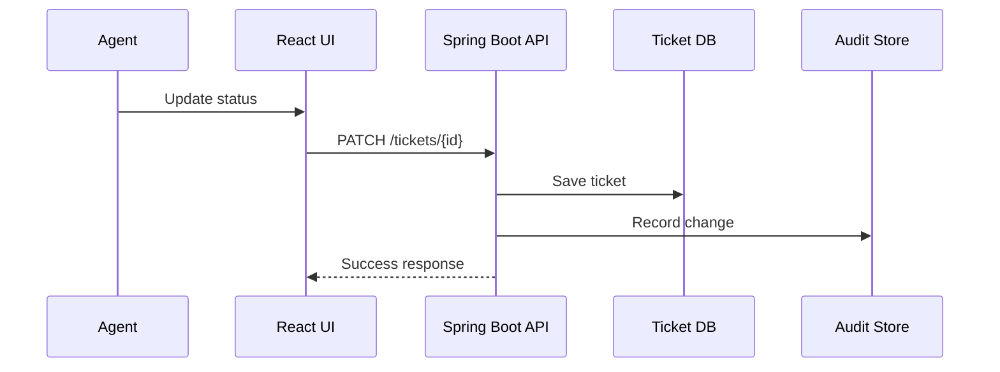

# Cover Page

**Document:** Engineering Delivery Plan  
**Skill:** `engineering-design-agent`  
**Status:** Sample output only  
**Audience:** Product, Engineering, QA

# Feature Summary

Build a customer support ticketing portal that lets agents search tickets, update status, add internal notes, and track assignment history.

# Executive Summary

This plan breaks the feature into 3 epics and a controlled delivery path. The solution uses a Spring Boot API with a React UI, role-based access, and audit logging for ticket changes. The main risks are search performance, concurrent status updates, and preserving a complete activity trail.

# Assumptions

- Agents authenticate through an existing identity provider.
- Ticket data already exists in the operational database.
- Search can start with database-backed filtering before dedicated indexing is introduced.

# Scope

In scope:

- Ticket list and detail views
- Status updates
- Internal notes
- Assignment history
- Audit logging

Out of scope:

- Customer self-service portal
- SLA automation
- Real-time chat

# Epics

1. Ticket Discovery
2. Ticket Collaboration
3. Audit and Reporting

# Story Breakdown

- Epic 1 focuses on search, filters, and ticket navigation.
- Epic 2 covers updates, notes, and assignment changes.
- Epic 3 provides audit history and reporting views.

# Dependencies

- Authentication service
- Ticket API
- Audit log storage

# Dependency Matrix

| Dependency | Epic 1 | Epic 2 | Epic 3 |
|---|---:|---:|---:|
| Authentication service | Yes | Yes | Yes |
| Ticket API | Yes | Yes | Yes |
| Audit log storage | No | Yes | Yes |

# Stories

## Story 1.1

As an agent, I want to filter tickets by status and priority so that I can find urgent work quickly.

- Estimate: 5 points
- Acceptance notes: filter by open, pending, and resolved states

## Story 2.1

As an agent, I want to update ticket status so that I can reflect the current handling state.

- Estimate: 8 points
- Acceptance notes: write an audit entry for every change

# BDD

- Given an authenticated agent
- When the agent opens the ticket list
- Then the system shows only tickets visible to that agent

# Gherkin Scenarios

```gherkin
Scenario: Update ticket status
  Given an open ticket assigned to the current agent
  When the agent changes the status to "In Progress"
  Then the ticket status is saved
  And an audit event is recorded
```

# Estimate Points

- Epic 1: 13 points
- Epic 2: 21 points
- Epic 3: 8 points

# Test Strategy

- Unit test status transition rules
- Integration test ticket update and audit write paths
- UI test ticket list filtering and detail actions

# Test Data

- Open ticket
- Pending ticket
- Resolved ticket
- Ticket with existing assignment history

# Architecture Overview

Spring Boot exposes ticket and audit endpoints. React consumes the APIs and renders list, detail, and action panels. Audit writes occur synchronously during updates to preserve traceability.

# HLD

The frontend uses a modular page and component structure. The backend separates controllers, services, repositories, and audit handlers. Shared authorization rules protect all ticket operations.

# LLD

- `TicketController` handles list, detail, and update endpoints.
- `TicketService` validates transitions and coordinates persistence.
- `AuditService` records old and new values for each change.

# Diagrams





# Risks

- Concurrent updates may overwrite newer ticket changes.
- Search may become slow as ticket volume grows.
- Audit failures must not silently drop change history.

# Next Steps

- Confirm ticket lifecycle rules.
- Validate search filters with real data volume.
- Define audit retention and access policies.
