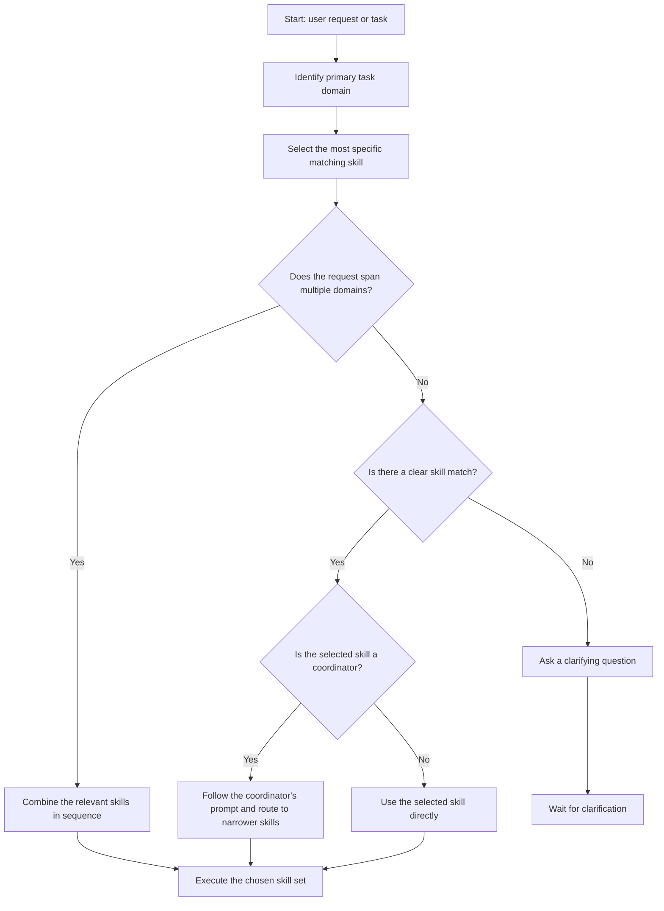

# Skills Selection Flow

```mermaid
flowchart TD
    A[Start: user request or task] --> B[Identify primary task domain]
    B --> C[Select the most specific matching skill]
    C --> D{Does the request span multiple domains?}
    D -- Yes --> E[Combine the relevant skills in sequence]
    D -- No --> F{Is there a clear skill match?}
    F -- No --> G[Ask a clarifying question]
    F -- Yes --> H{Is the selected skill a coordinator?}
    H -- Yes --> I[Follow the coordinator's prompt and route to narrower skills]
    H -- No --> J[Use the selected skill directly]
    E --> K[Execute the chosen skill set]
    G --> L[Wait for clarification]
    I --> K
    J --> K
```

Use this diagram as a visual companion to [.github/skills/SKILL.md](/Users/maheswarbuddolla/softwares/skills3/.github/skills/SKILL.md).
