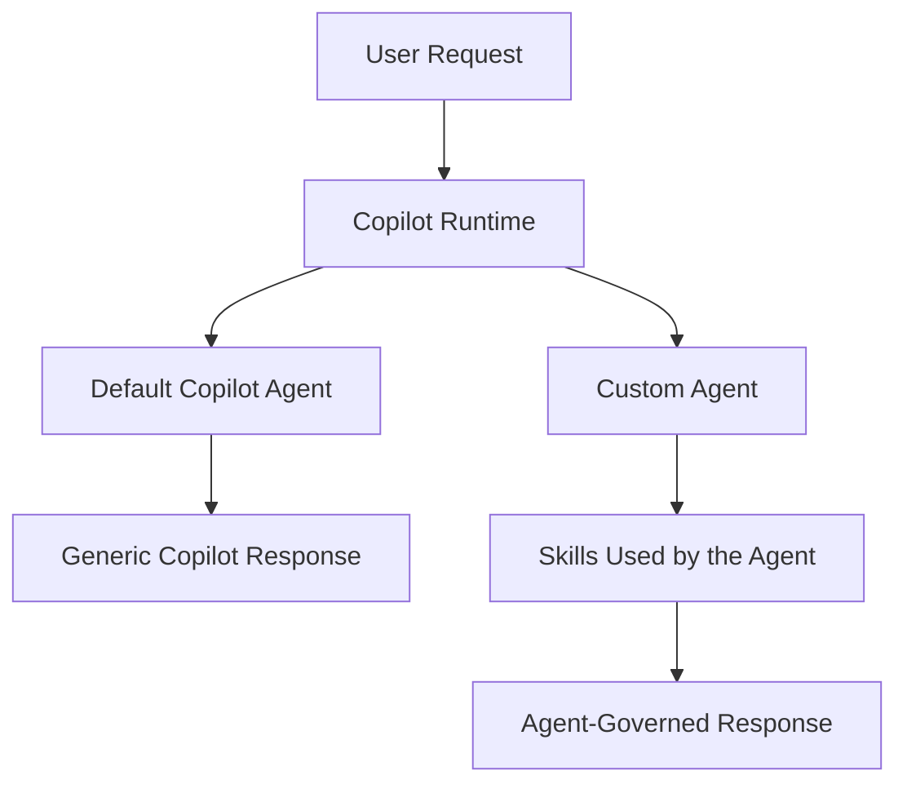
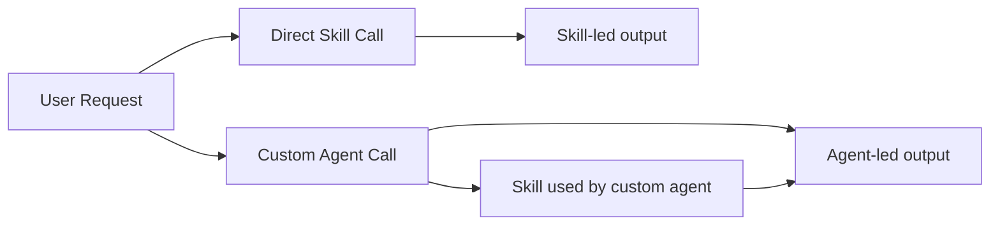

# Skill vs. Agent Behavior in GitHub Copilot

## Overview

A **skill** and a **custom agent** are not the same layer in Copilot. They may use related instructions, but they are loaded and applied differently, which is why the same task can produce different results depending on whether you invoke a skill directly or use it through an agent.

This document summarizes that difference and keeps the relevant GitHub Docs references for follow-up reading.

## Key Difference

- **Skill**: a reusable capability module focused on a narrow task.
- **Custom agent**: the active controller that defines role, workflow, tone, and boundaries.
- **Agent + skill**: the agent remains in charge, and the skill acts as a supporting capability.

## Why the Behavior Changes

### 1. Direct skill invocation

When a skill is called directly, its instructions and local resources tend to have stronger visible influence. The result often feels more focused, but also more dependent on the immediate context.

### 2. Agent invoking skills

When a custom agent uses a skill, the agent’s own instructions take priority. The agent controls:

- response structure
- workflow steps
- tool boundaries
- tone and style
- how the skill output is interpreted

This is why the same skill can behave differently when used alone versus inside an agent.

## Mental Model

### Flow Comparison

## Comparison

| Component | Primary Role | Typical Behavior |
| --- | --- | --- |
| Skill | Reusable task capability | Narrow, task-specific, conditional |
| Custom agent | Orchestrator and persona | Structured, consistent, policy-driven |
| Agent + skill | Controller plus specialist | Agent-led behavior with skill support |

## Recommended Usage

- Use a **skill** when the capability is narrow and reusable.
- Use a **custom agent** when you need deterministic behavior and structured output.
- Use **agent + skill** when you want modular capabilities under a controlled workflow.

## GitHub Docs References

- [Custom skills overview](https://docs.github.com/en/enterprise-cloud%40latest/copilot/how-tos/copilot-sdk/use-copilot-sdk/custom-skills)
- [Add skills to Copilot agents](https://docs.github.com/en/copilot/how-tos/use-copilot-agents/cloud-agent/add-skills)
- [Customize Copilot overview](https://docs.github.com/en/copilot/how-tos/copilot-cli/customize-copilot/overview)
- [About custom agents](https://docs.github.com/en/copilot/concepts/agents/cloud-agent/about-custom-agents)
- [About custom agents for Copilot CLI](https://docs.github.com/en/copilot/concepts/agents/copilot-cli/about-custom-agents)
- [Comparing Copilot features](https://docs.github.com/en/copilot/concepts/agents/copilot-cli/comparing-cli-features)
- [Customization cheat sheet](https://docs.github.com/en/enterprise-cloud%40latest/copilot/reference/customization-cheat-sheet)

## Short Conclusion

If you want predictable behavior, use a **custom agent**. If you want a reusable task capability, use a **skill**. If you need both, let the **custom agent** control the workflow and delegate the specialized work to the skill.
