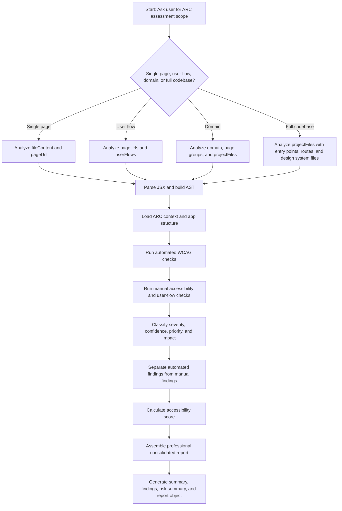
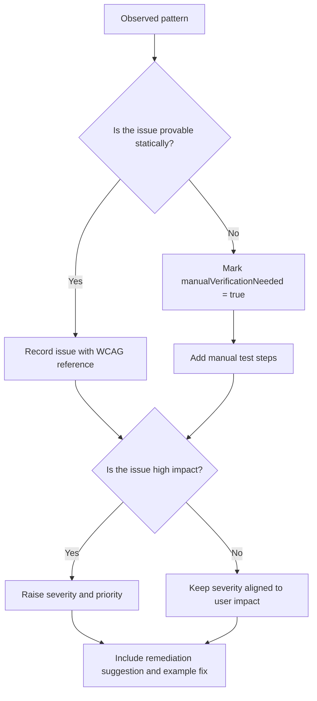
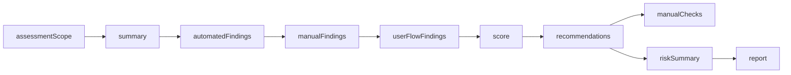

# React ADA Accessibility Analyzer - Agent View

This view summarizes how `react-ada-analyze` should behave in practice.

## Agent Overview

- Input: React `JSX/TSX`, optional ARC-style context via `pageUrl`, `pageUrls`, `domain`, `userFlows`, `projectFiles`, entry points, routes, and design system files.
- Goal: Detect accessibility risks, separate automated findings from manual findings, and provide practical remediation guidance.
- Output: Summary, automated findings, manual findings, user-flow findings, score, recommendations, risk summary, and a professional consolidated report.

## Main Workflow

## Analysis Decision Flow

## Practical Rules

- Prefer precision over noise.
- Use semantic HTML before ARIA where possible.
- Use repository context when available to identify cross-page, shared-component, and route-level issues.
- Treat page, flow, and domain scope as first-class ARC concepts.
- Call out keyboard, focus, screen reader, contrast, reflow, live region, and motion concerns.
- Distinguish between code-level defects and runtime behavior that needs manual testing.
- Do not claim ADA compliance certification from static analysis alone.
- Separate automated findings, manual findings, and user-flow findings in the final report.

## Preferred Prompts

- What do you want me to analyze?
- What ARC assessment scope should I use?
- Do you want a quick scan or deep accessibility audit?
- Should I include manual test cases for screen reader and keyboard verification?
- Do you want WCAG reference links in the report?

## Expected Output Shape

