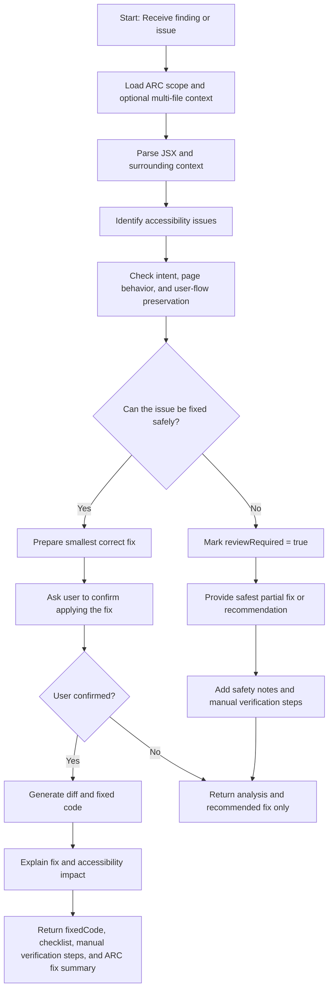
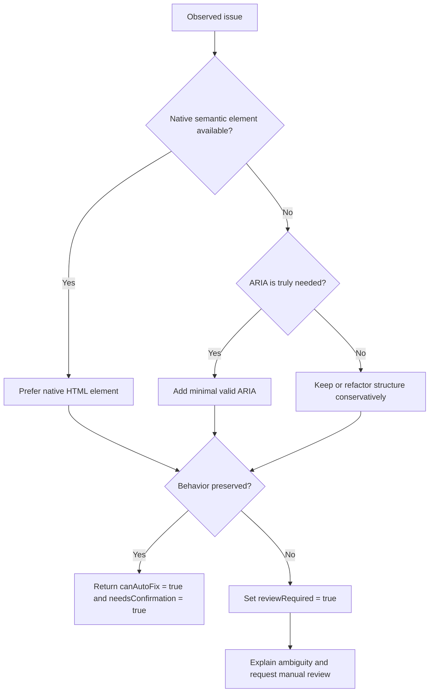
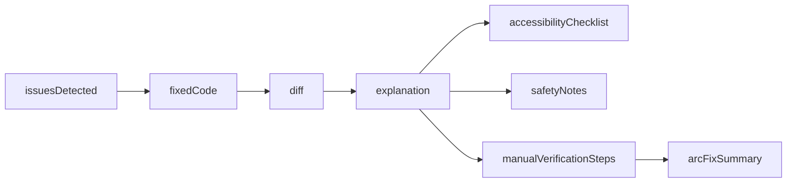

# React ADA Accessibility Fixer - Agent View

This view summarizes how `react-ada-fixer` should behave in practice.

## Agent Overview

- Input: React `JSX/TSX`, optional ARC-style context, a finding or issue description, and component purpose.
- Goal: Apply conservative accessibility fixes without changing product intent.
- Output: Fixed code, diff, explanation, checklist, safety notes, manual verification steps, and an ARC fix summary.

## Main Workflow

## Fix Decision Flow

## Practical Rules

- Prefer semantic HTML before ARIA.
- Do not convert behavior blindly if the control is not actually a button.
- Always preserve keyboard support, focus behavior, and accessible naming.
- Return manual verification steps when static analysis cannot prove runtime behavior.
- Flag ambiguous cases instead of guessing.
- Keep the ARC scope in view so fixes do not break a page, user flow, or domain-level pattern.

## Expected Output Shape

