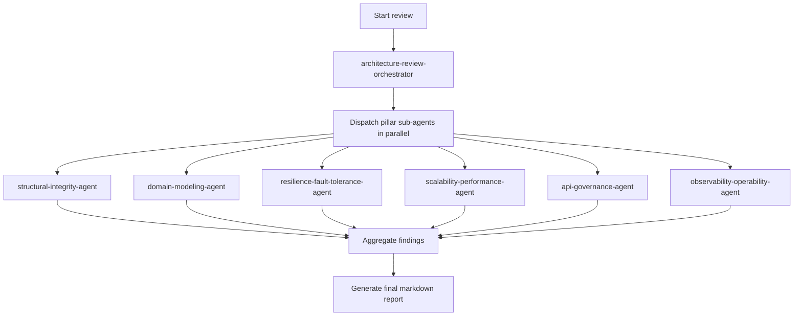

# Architecture Review Orchestrator

## Purpose
This agent family converts a single architecture-review JSON definition into an enterprise-grade `.md` orchestrator design for IntelliJ Copilot.

## How the agents interact
1. The orchestrator coordinates the full review.
2. Specialized sub-agents analyze their own pillar.
3. Reusable skills provide shared logic for analysis, ADR generation, and Mermaid diagrams.
4. The orchestrator aggregates all outputs into one final markdown report.

## Flow Chart

## Orchestrator flow
- parallel sub-agent execution
- aggregation of findings
- final markdown report generation

## Final report sections
- Executive Summary
- 6-Pillar Architecture Scorecard
- Critical Findings
- Architectural Smells
- Refactoring Recommendations
- C4 Diagrams
- Architecture Decision Records (ADRs)
- Technical Debt Roadmap
- Quick Wins vs Strategic Improvements

## Example prompts for IntelliJ
- `@architecture-review-orchestrator review this service layer for architecture smells`
- `@architecture-review-orchestrator analyze bounded contexts and resilience for the current module`
- `@architecture-review-orchestrator run a 6-pillar architecture review with Mermaid diagrams`

## How to extend
- Add a new sub-agent when a new architecture pillar is introduced.
- Add a reusable skill when logic is shared across multiple agents.
- Keep the orchestrator focused on coordination, aggregation, and final report generation.

## Notes
- This package is intentionally markdown-only for Copilot-style use.
- The JSON source remains available as the original contract, but the markdown agents are the operating model.
