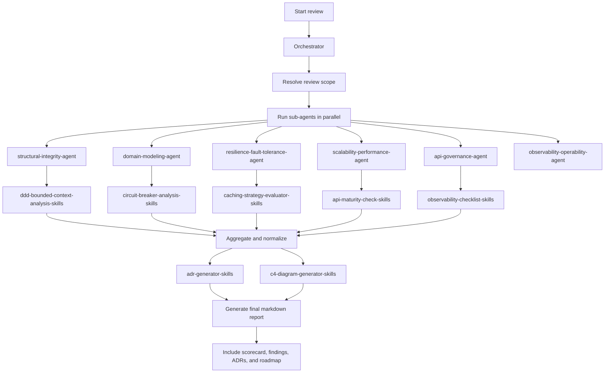

# Architecture Review Orchestrator - Instructions Overview

## Overview

This folder contains the Copilot-style markdown operating model for the `Architecture Review Orchestrator`.

Key files:

- [`architecture-review-orchestrator.md`](architecture-review-orchestrator.md)
- [`structural-integrity-agent.md`](structural-integrity-agent.md)
- [`domain-modeling-agent.md`](domain-modeling-agent.md)
- [`resilience-fault-tolerance-agent.md`](resilience-fault-tolerance-agent.md)
- [`scalability-performance-agent.md`](scalability-performance-agent.md)
- [`api-governance-agent.md`](api-governance-agent.md)
- [`observability-operability-agent.md`](observability-operability-agent.md)

## Architecture Summary

The instructions implement an enterprise-grade agent-of-agents design:

- one orchestrator coordinates the review
- six sub-agents analyze distinct architecture pillars
- reusable skills provide shared analysis and diagram logic
- the final output is one consolidated markdown report

## Reusable Skills

The skills below support the review pipeline:

- `ddd-bounded-context-analysis` for domain seams and bounded contexts
- `circuit-breaker-analysis` for resilience and dependency failure handling
- `caching-strategy-evaluator` for throughput and latency optimization
- `api-maturity-check` for public API design and contract quality
- `observability-checklist` for logging, metrics, tracing, and operability
- `adr-generator` for architecture decision records
- `c4-diagram-generator` for Mermaid-based architecture diagrams

## Flow Chart

## Orchestration Flow

1. The orchestrator starts the review.
2. Specialized sub-agents run conceptually in parallel.
3. Findings are aggregated and normalized.
4. The orchestrator generates the final markdown report.

## Output Contract

The final report includes:

- Executive Summary
- 6-Pillar Architecture Scorecard
- Critical Findings
- Architectural Smells
- Refactoring Recommendations
- C4 Diagrams
- Architecture Decision Records (ADRs)
- Technical Debt Roadmap
- Quick Wins vs Strategic Improvements

## Extensibility

Add a new sub-agent when a new architecture pillar is introduced. Add a reusable skill when logic should be shared across multiple agents.

## Presentation Note

Think of the instructions as the executable operating model. They are designed for IntelliJ Copilot use and should be read as the practical implementation of the JSON contract.
