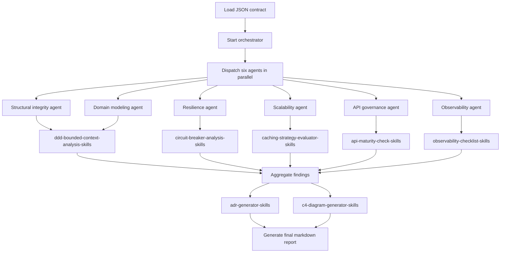

# Architecture Review Orchestrator - JSON Overview

## Overview

This folder contains the machine-readable contract for the `Architecture Review Orchestrator`.

Primary file:

- [`architecture-review-orchestrator.json`](architecture-review-orchestrator.json)

## Purpose

The JSON defines the base orchestrator contract:

- orchestrator identity and version
- parallel-then-aggregate execution model
- six specialized agents
- markdown output schema

## Architecture Summary

The JSON expresses the core orchestration model:

- one orchestrator
- six pillar-specific agents
- parallel review execution
- result aggregation
- single final markdown report

## Reusable Skills

The orchestrator reuses shared skills to keep reviews consistent:

- `ddd-bounded-context-analysis` for domain modeling and boundary checks
- `circuit-breaker-analysis` for resilience and fault-tolerance review
- `caching-strategy-evaluator` for scalability and performance review
- `api-maturity-check` for API governance review
- `observability-checklist` for observability and operability review
- `adr-generator` for decision capture during aggregation
- `c4-diagram-generator` for Mermaid diagrams in the final report

## Flow Chart

## Invocation Pattern

Use this contract when the review needs:

- structural analysis
- domain modeling review
- resilience and fault tolerance review
- scalability and performance review
- API governance review
- observability and operability review

## Output Contract

The generated report includes:

- Executive Summary
- 6-Pillar Scorecard
- Critical Findings
- Architecture Smells
- Refactoring Recommendations
- C4 Diagrams
- Architecture Decision Records (ADRs)
- Technical Debt Roadmap

## Presentation Note

Think of the JSON as the stable execution contract for the orchestrator. It is concise, deterministic, and intended to remain the source definition behind the markdown agent layer.
