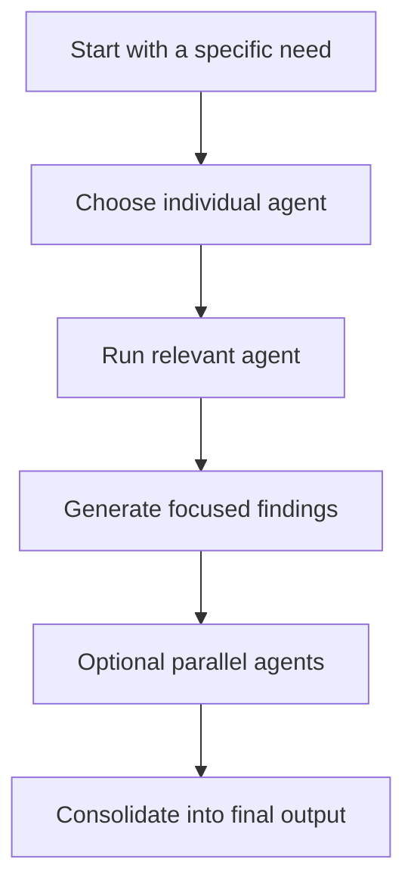

# Code Generator Agents - Instructions Overview

## Overview

This folder contains the Copilot-style markdown agents for the `code-generation-agents`.

Key files:
- [`gradle-buildAnalyzer-helper.md`](gradle-buildAnalyzer-helper.md)
- [`postman-collection-generator.md`](postman-collection-generator.md)
- [`java-development-helper.md`](java-development-helper.md)
- [`database-queries-analyzer.md`](database-queries-analyzer.md)
- [`yaml-analyzer-helper.md`](yaml-analyzer-helper.md)
- [`test-coverage-helper.md`](test-coverage-helper.md)
- [`java-exception-detection.md`](java-exception-detection.md)
- [`package-analyzer.md`](package-analyzer.md)

## Purpose

These instructions convert the contract into individually usable agents for:
- Gradle build analysis
- API documentation
- Java quality
- SQL and JDBC analysis
- YAML and Kubernetes validation
- test coverage review
- exception and runtime-risk review
- package-level structural analysis

## Supported Agents

- Postman Collection Generator
- Gradle Build Analyzer Helper
- Java Development Helper
- Database Queries Analyzer
- YAML Analyzer Helper
- Test Coverage Helper
- Java Exception Detection
- Package Analyzer

## Architecture Overview

The instructions are split into standalone agents so each concern can be invoked directly and independently.

## Notes

- Reusable skills are not required for this agent set.
- This agent set is driven by standalone agents and does not require a separate `Skills` section.
- Keep the agents standalone unless multiple agents begin sharing identical analysis logic.
- The markdown agents should stay aligned with the JSON contract and `@agent` syntax.

## How To Use

### @agent Syntax
- `@postman-collection-generator`
- `@gradle-buildAnalyzer-helper`
- `@java-development-helper`
- `@database-queries-analyzer`
- `@yaml-analyzer-helper`
- `@test-coverage-helper`
- `@java-exception-detection`
- `@package-analyzer`

### Example Invocations
- `@gradle-buildAnalyzer-helper analyze build.gradle for unused dependencies`
- `@postman-collection-generator generate a Postman collection from Spring Boot controllers`
- `@java-development-helper review Java files for null safety`
- `@database-queries-analyzer analyze SQL queries for performance issues`
- `@yaml-analyzer-helper validate application.yml and Kubernetes manifests`
- `@test-coverage-helper identify missing tests`
- `@java-exception-detection inspect exception handling and runtime risks`
- `@package-analyzer scan package portal`

## Best Practice

Use the most specific agent first. Combine agents only when the request spans multiple concerns.
