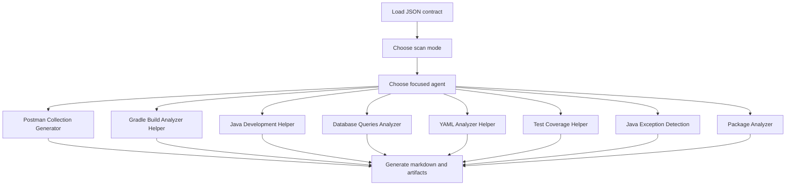

# Code Generator Agents - JSON Overview

## Overview

This folder contains the machine-readable contract for the `code-generation-agents`.

Primary file:

- [`code-generation.json`](code-generation.json)

## Purpose

The JSON defines the orchestrator contract for a Spring Boot and Java code-assistance agent set. It provides:
- the agent-set identity
- scan modes
- routing inputs
- output contract
- agent inventory
- predefined prompts

## Supported Agents

- Postman Collection Generator
- Gradle Build Analyzer Helper
- Java Development Helper
- Database Queries Analyzer
- YAML Analyzer Helper
- Test Coverage Helper
- Java Exception Detection
- Package Analyzer

## Architecture Overview

The JSON contract expresses a multi-agent agent set with:
- individual specialist agents
- focused responsibilities
- prompt-based routing
- consolidated reporting output

## Notes

- Reusable skills are not required for this agent set.
- This agent set is driven by standalone agents and does not require a separate `Skills` section.
- Keep these agents standalone unless a new shared workflow clearly needs skill extraction.
- The JSON contract and instruction files should stay aligned on agent names and `@agent` syntax.

## Output Contract

The contract produces:
- `postman-collection.json`
- `code-generation-report.md`

## Best Practice

Use the JSON when you need the source contract, routing metadata, and agent inventory.
