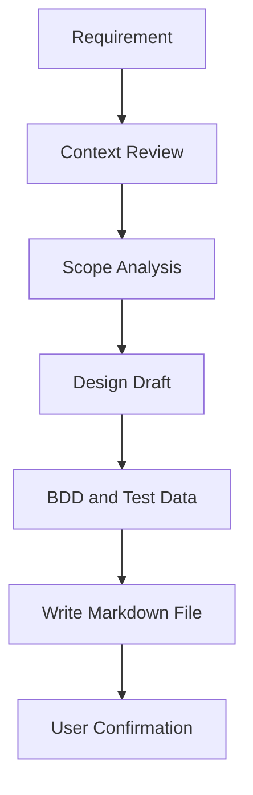
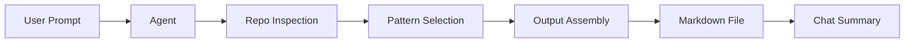

# Engineering Design Agent Overview

## Purpose
The `engineering-design-agent` turns a requirement into structured engineering documentation. It is intended for repo-aware design work, including BDD breakdowns, HLD/LLD, Mermaid diagrams, test data, dependencies, risks, assumptions, and estimation.

## When To Use It
Use this agent when you need to:
- break down a feature into epics, user stories, subtasks, and story points
- generate BDD scenarios and test data
- produce architecture-level design artifacts
- create a reusable markdown deliverable for a feature or report

## Inputs
### Required
- `requirement`: a plain-text feature or problem statement

### Optional
- `projectType`: helps narrow scope, such as web app, API, or service
- `techStack`: helps tailor the design to the actual stack
- `architectureType`: helps steer the design style, such as monolith or distributed

## Output
The agent writes a markdown file to `docs/generated/` using the naming pattern:

`{feature-name}-design-bdd-breakdown.md`

The content typically includes:
- Architecture Overview
- High-Level Design
- Low-Level Design
- Architecture Diagrams
- Epics and User Stories
- Subtasks
- BDD Scenarios
- Test Data
- Tasks, Dependencies, Execution Plan
- Risks, Assumptions, NFRs
- Estimation Summary

## Workflow
1. Inspect the repository context first.
2. Review the README, build file, and relevant source/config files.
3. Infer the feature scope from the requirement.
4. Produce a structured markdown artifact.
5. Save the result to `docs/generated/`.
6. Confirm the file path and summarize the output in chat.

## Flow Charts
### Input To Output Flow


### Agent Execution Flow


## Guardrails
- Ask clarifying questions if the requirement is too broad or ambiguous.
- Include story points for each user story.
- Include at least 3 subtasks per story.
- Include at least 3 BDD scenarios per story.
- Include positive, negative, boundary, and edge test data.
- Keep output aligned with the actual repository stack and conventions.
- Use `file_operations` for file creation.

## Supporting Files
- Agent config: `.github/agents/engineering-design-agent.json`
- Agent guide: `.github/agents/engineering-design-agent.md`
- Sample output template: `.github/agents/engineering-design-report-template.md`

## Example Use
```text
Generate a design and BDD breakdown for a team capacity planning feature in a Jira Align-style product.
```

## Notes
This overview is intentionally short. Use it as the first stop, then open the agent guide for the full rule set and template paths.
