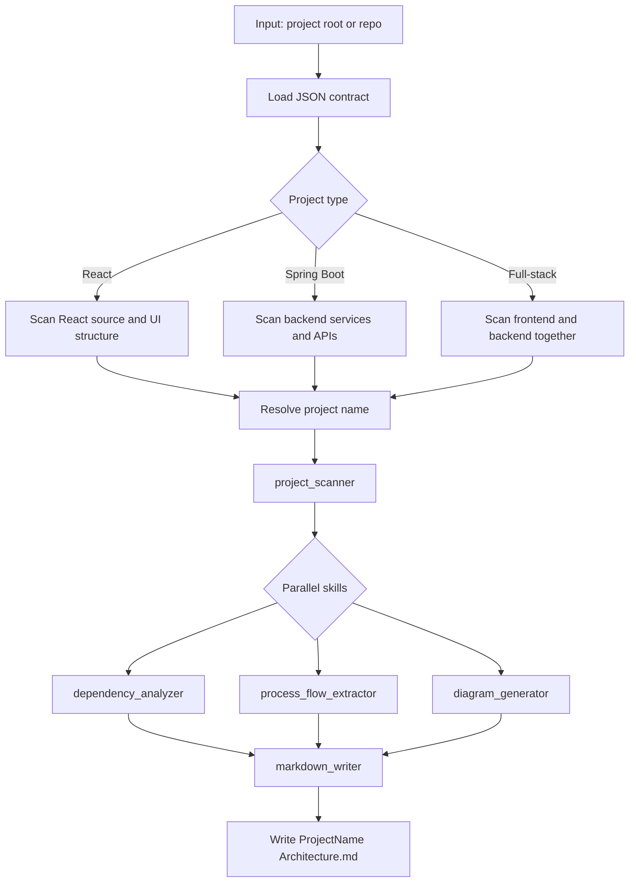

# Fullstack Project Architecture Analyzer - JSON Contract

## Overview

This folder contains the original machine-readable definition of the fullstack project architecture analyzer.

Primary file:

- [`fullstack-project-architecture-analyzer.json`](fullstack-project-architecture-analyzer.json)

## Purpose

The JSON defines the agent contract, including:

- triggers
- execution strategy
- input schema
- output schema
- skill workflow
- interaction behavior
- supported analysis modes

## Flow Chart

## How To Use

Use this contract when you need a stable configuration for:

- full repository analysis
- git diff analysis
- React projects
- Spring Boot projects
- full-stack projects

Recommended input patterns:

- `mode=full-repo` for complete repository analysis
- `mode=git-diff` for changed-file analysis
- `projectType=auto` for automatic stack detection
- `interactive=true` for guided clarification when needed

## Output

The JSON is designed to produce a Markdown architecture document named:

`{ProjectName}-Architecture.md`

Core sections include:

- Architecture Overview
- Technology Stack Summary
- System Context & External Integrations
- High-Level Design
- Low-Level Design
- Architecture Diagrams
- Flow Diagrams
- Component Responsibilities
- Dependency Mapping

## Presentation Summary

Think of the JSON as the operational contract:

- compact
- machine-readable
- reproducible
- suitable as the base source of truth

## Notes

- This overview does not use a `scanMode` field.
- The real branching is based on project type only.
