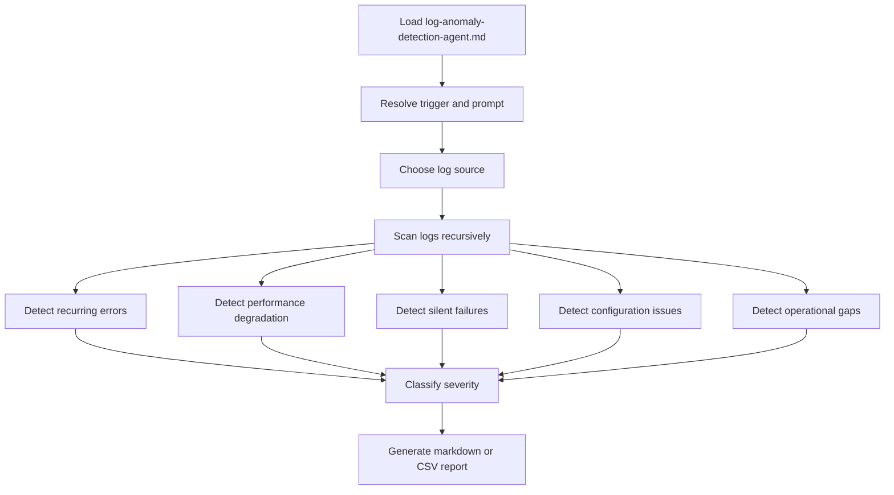
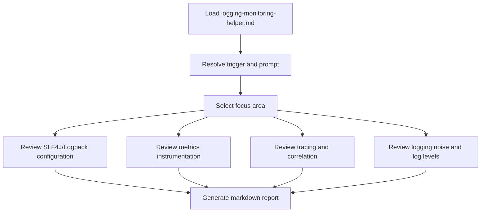
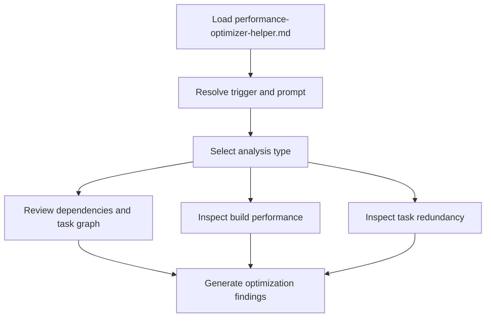

# Observability Agents Overview

## Overview

This folder contains observability-focused agents for logging, anomaly detection, and performance review.

## Agents

- [`log-anomaly-detection-agent.md`](../instructions/log-anomaly-detection-agent.md) - scan logs for recurring errors, silent failures, configuration issues, and operational gaps
- [`logging-monitoring-helper.md`](../instructions/logging-monitoring-helper.md) - review logging, MDC, metrics, tracing, and observability hygiene in Spring Boot services
- [`performance-optimizer-helper.md`](../instructions/performance-optimizer-helper.md) - identify Java and Spring Boot performance bottlenecks

## Primary JSON Contracts

- [`log-anomaly-detection-agent.json`](log-anomaly-detection-agent.json)
- [`logging-monitoring-helper.json`](logging-monitoring-helper.json)
- [`performance-optimizer-helper.json`](performance-optimizer-helper.json)

## Typical Uses

- `log-anomaly-detection-agent` for production log analysis and anomaly reports
- `logging-monitoring-helper` for logging quality, metrics, tracing, and MDC checks
- `performance-optimizer-helper` for CPU, memory, database, and concurrency review

## Flow Charts

### `log-anomaly-detection-agent`

### `logging-monitoring-helper`

### `performance-optimizer-helper`

## Notes

- Reusable skills are not required for this suite.
- Keep the instruction files aligned with the JSON contracts and trigger patterns.
