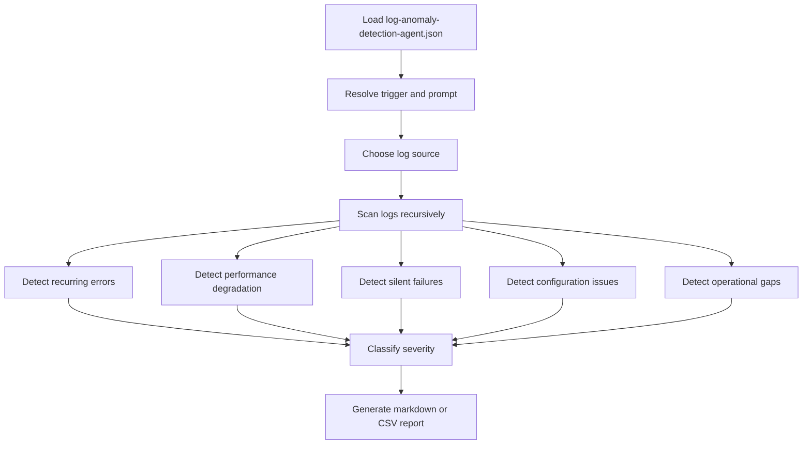
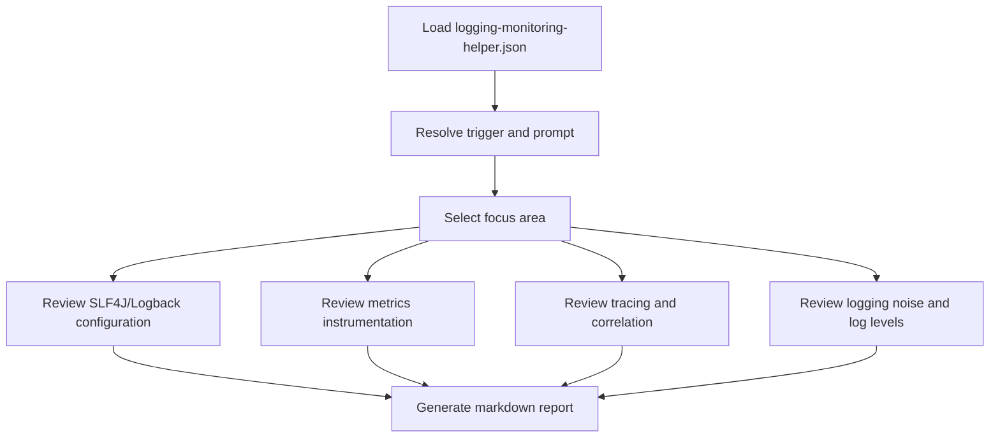
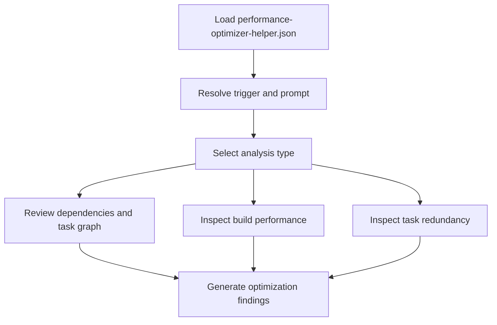

# Observability Agents Overview - JSON

## Overview

This folder contains the machine-readable contracts for the observability agents.

## Agents

- [`log-anomaly-detection-agent.json`](log-anomaly-detection-agent.json) - detect recurring errors, silent failures, performance degradation, and observability gaps in logs
- [`logging-monitoring-helper.json`](logging-monitoring-helper.json) - review logging, MDC, metrics, tracing, and observability hygiene in Spring Boot services
- [`performance-optimizer-helper.json`](performance-optimizer-helper.json) - identify Java and Spring Boot performance bottlenecks

## Purpose

These JSON contracts define the agent identity, prompts, tools, guided interaction, and output behavior for observability-focused analysis.

## Typical Uses

- production log anomaly analysis
- logging and monitoring review
- performance review for Java and Spring Boot services
- observability and incident-readiness checks

## Flow Charts

### `log-anomaly-detection-agent`

### `logging-monitoring-helper`

### `performance-optimizer-helper`

## Notes

- Reusable skills are not required for this suite.
- Keep the JSON and instruction files aligned on agent names and trigger patterns.
