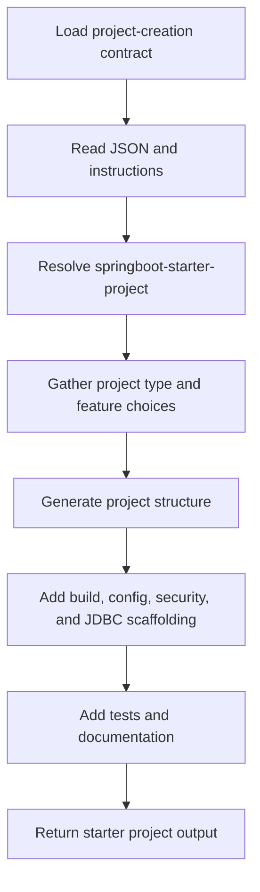

# Project Creation Agent Overview

## Overview

This folder contains the machine-readable contract and instruction file for the `springboot-starter-project` agent.

## Files

- [`springboot-starter-project.json`](springboot-starter-project.json)
- [`springboot-starter-project.md`](../instructions/springboot-starter-project.md)

## Flow Chart

## Purpose

The agent generates a production-ready Spring Boot starter project with:
- REST controllers
- JDBC or `JdbcTemplate` data access
- Spring Security baseline configuration
- JUnit 5 and Mockito testing setup
- `application.yml` and properties templates

## Typical Uses

- scaffold a new Spring Boot service
- standardize a single-module project
- generate a multi-module project layout
- add starter build and configuration templates

## Example Prompt

- `@springboot-starter-project projectType=single features=rest,jdbc,testing`
