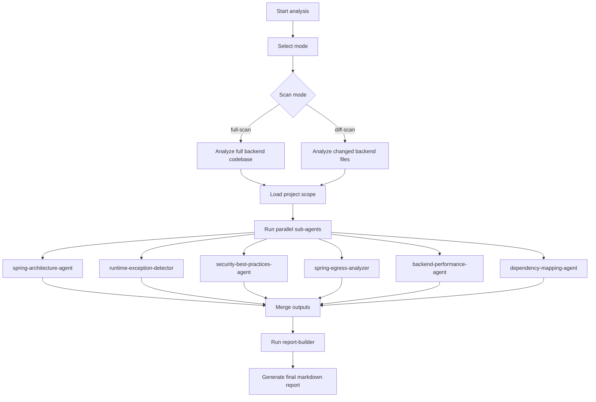

# Spring Backend Engineering Suite - Instructions Overview

## Overview

This folder contains the enterprise-grade instruction set that expands the JSON contract into an orchestrated backend analysis workflow.

Key files:

- [`spring-backend-engineering-suite.md`](spring-backend-engineering-suite.md)
- [`skills/`](skills/)
- [`sub-agents/`](sub-agents/)

## Purpose

The instructions implement an agent-of-agents pattern for Spring Boot and Java backend review:
- the orchestrator coordinates execution
- sub-agents handle specialized backend analysis
- reusable skills provide shared analysis rules
- the final output is a structured markdown report

## Skill Files

The reusable skills provide the shared backend analysis behavior:

- `code-scope-loader.md` loads full or diff scope
- `spring-structure-detector.md` identifies architecture and layering
- `risk-prioritizer.md` normalizes findings by severity and impact
- `report-builder.md` consolidates findings into the final report
- `java-exception-patterns.md` detects runtime and exception risks
- `spring-security-patterns.md` detects authentication and authorization issues
- `egress-patterns.md` detects outbound integration risks
- `performance-patterns.md` detects backend performance bottlenecks
- `dependency-patterns.md` detects coupling and dependency smells

## Flow Chart

## Notes

- `full-scan` is for baseline audits.
- `diff-scan` is for pull requests and targeted validation.
- Keep the instruction files, skills, and sub-agents aligned with the JSON contract.
