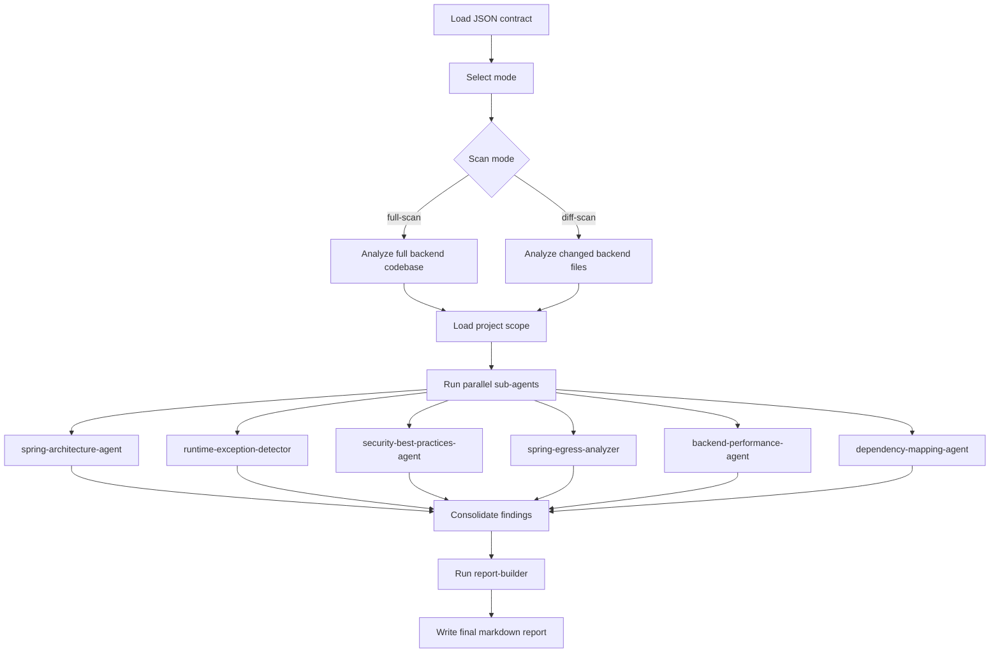

# Spring Backend Engineering Suite - JSON Overview

## Overview

This folder contains the machine-readable contract for the `spring-backend-engineering-suite`.

Primary file:

- [`spring-backend-engineering-suite.json`](spring-backend-engineering-suite.json)

## Purpose

The JSON defines the orchestrator contract for Spring Boot and Java backend analysis, including:
- full-scan and diff-scan support
- stack hints
- parallel analyzer execution
- reusable skill workflow
- consolidated markdown reporting

## Skill Files

The JSON contract relies on these reusable skill files:

- [`code-scope-loader.md`](../instructions/skills/code-scope-loader.md)
- [`spring-structure-detector.md`](../instructions/skills/spring-structure-detector.md)
- [`risk-prioritizer.md`](../instructions/skills/risk-prioritizer.md)
- [`report-builder.md`](../instructions/skills/report-builder.md)
- [`java-exception-patterns.md`](../instructions/skills/java-exception-patterns.md)
- [`spring-security-patterns.md`](../instructions/skills/spring-security-patterns.md)
- [`egress-patterns.md`](../instructions/skills/egress-patterns.md)
- [`performance-patterns.md`](../instructions/skills/performance-patterns.md)
- [`dependency-patterns.md`](../instructions/skills/dependency-patterns.md)

## Sub-Agents

- `spring-architecture-agent`
- `runtime-exception-detector`
- `security-best-practices-agent`
- `spring-egress-analyzer`
- `backend-performance-agent`
- `dependency-mapping-agent`

## Flow Chart

## Output

The contract produces a markdown report with:
- Executive Summary
- Scan Scope
- Architecture Signals
- Critical Findings
- Agent Findings
- Risk Matrix
- Suggested Fixes
- Priority Action Plan
- Reusable Skill Notes

## Notes

- `full-scan` is for baseline audits and `diff-scan` is for targeted review.
- Keep the skill files aligned with the sub-agents and report sections.
