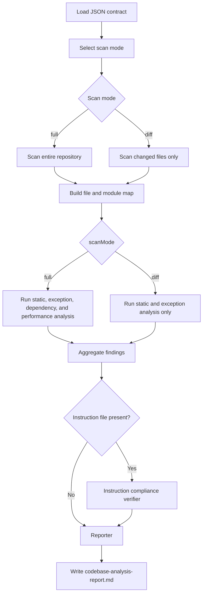

# Ultimate Codebase Analysis Agent - JSON Overview

## Overview

This folder contains the machine-readable contract for the `ultimate-codebase-analysis-agent`.

Primary file:

- [`ultimate-codebase-analysis-agent.json`](ultimate-codebase-analysis-agent.json)

## Purpose

The JSON defines the full-scale analysis contract for large codebases, including:
- scan mode selection
- module-based chunking
- parallel specialist analysis
- instruction compliance verification
- consolidated markdown report generation

## Architecture Overview

The contract coordinates a multi-agent review pipeline for large repositories:
- scanner builds the project map
- specialist analyzers run in parallel
- compliance verification applies instruction-based rules
- reporter generates the final markdown output

## Flow Chart

## Agents and Responsibilities

- `scanner` discovers repository structure and prepares analysis scope.
- `static-analyzer` detects defects, anti-patterns, and performance issues.
- `exception-analyzer` reviews exception handling and runtime failure modes.
- `dependency-analyzer` reviews build and dependency health.
- `performance-analyzer` reviews hot paths, allocation pressure, caching, and concurrency.
- `instruction-compliance-verifier` enforces rules from the instruction source.
- `reporter` generates the final executive report.

## Output

The contract produces `codebase-analysis-report.md` with:
- Summary
- Critical Issues
- High Issues
- Medium Issues
- Low Issues
- Exception Highlights
- Dependency Risks
- Performance Highlights
- Compliance Summary
- Compliance Violations
- Recommendations

## Notes

- Minimum agents: 6
- Maximum agents: 9
- Scan mode is selected as `full` or `diff` before analysis begins
- `full` runs dependency and performance analysis; `diff` skips both
- Run compliance verification only when instruction files are present
- The JSON contract is the source of truth for execution strategy and reporting structure
