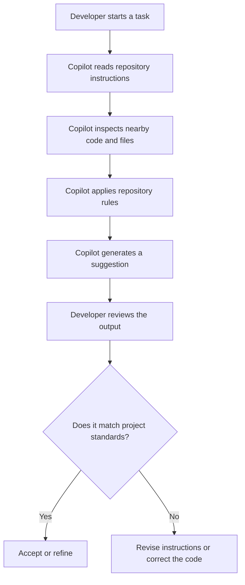
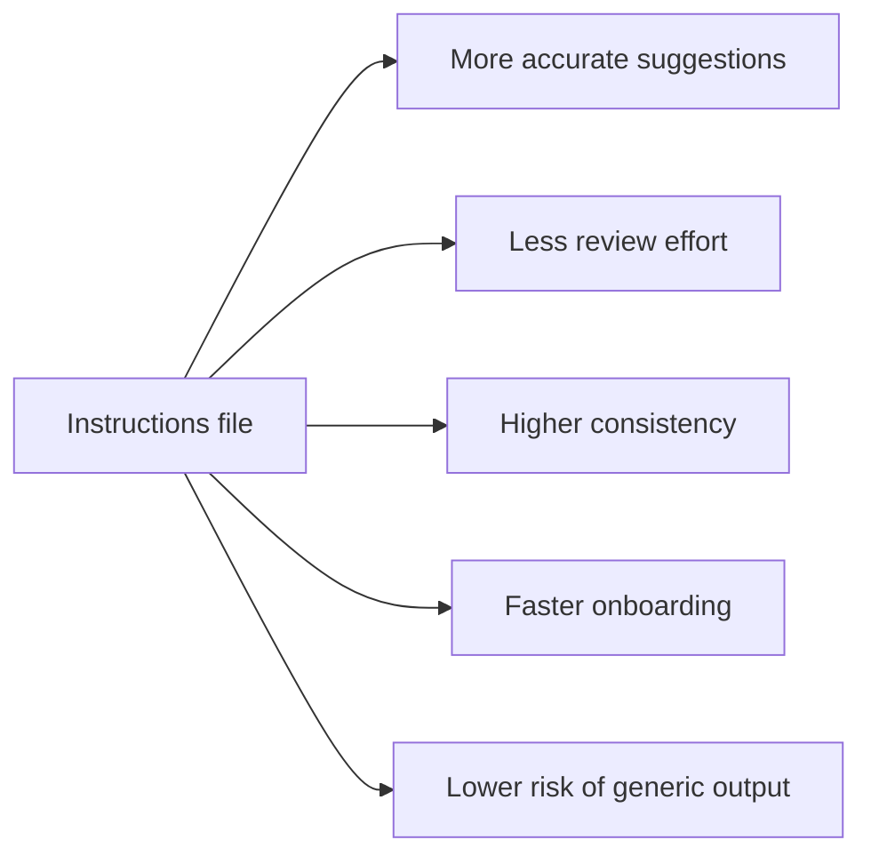
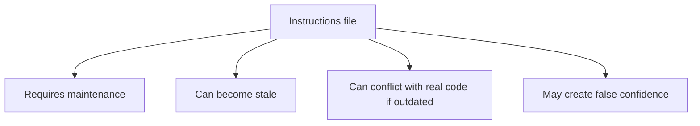
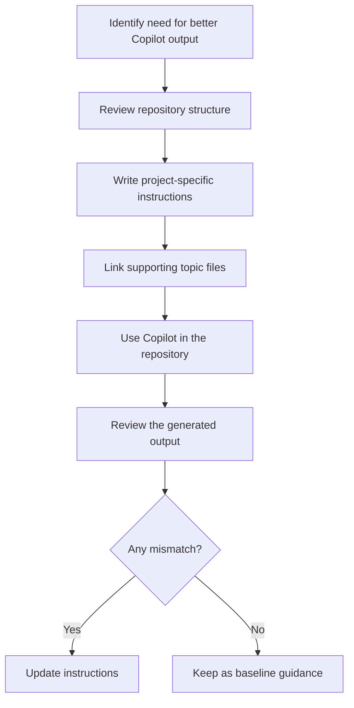

# Copilot Instructions File Guide

## Executive Summary

A Copilot instructions file defines how GitHub Copilot should behave inside a repository. It gives the assistant project-specific context, rules, and boundaries so its output aligns with the codebase instead of generic defaults.

In this repository, the primary example is `.github/copilot-instructions.md`.

## Purpose

The file is used to reduce ambiguity and improve consistency. It tells Copilot:

- What the project is
- How the codebase is organized
- Which conventions must be followed
- Which assumptions should be avoided
- When to refer to deeper topic files

Without this guidance, Copilot tends to infer a generic pattern. With it, the assistant can produce suggestions that are more accurate, maintainable, and easier to review.

## Typical Contents

- Project context
- Language and framework standards
- Architecture and layering rules
- Naming and package conventions
- Testing and validation expectations
- Non-negotiable constraints

## Operating Model

## How To Use It

1. Place repository-wide rules in the main instructions file.
2. Keep the guidance short, direct, and specific.
3. Describe the actual codebase, not an idealized template.
4. Link to topic-specific documents when detailed rules are needed.
5. Update the file when architecture, conventions, or tooling changes.

### Include

- Real root package and module layout
- Actual framework and language versions
- Existing layer responsibilities
- API, exception, and validation patterns
- Test strategy and quality expectations
- Security, logging, and observability rules

### Avoid

- Generic statements such as "write clean code"
- Rules that conflict with the codebase
- Long policy blocks that duplicate general knowledge
- Multiple files that give contradictory guidance

## Why It Helps

- Improves alignment with the repository's real structure
- Reduces cleanup during code review
- Keeps suggestions consistent across contributors
- Speeds up onboarding for new developers and agents
- Lowers the chance of irrelevant or template-driven output

## Tradeoffs

- It must be maintained as the project evolves.
- Incorrect guidance can mislead Copilot.
- Overly broad rules reduce usefulness.
- It adds another artifact that must be kept current.

## Limitations

- It cannot replace code review.
- It cannot guarantee architectural correctness.
- It does not eliminate the need for local code context.
- It is only effective when the repository has stable conventions.
- Its value decreases if the content becomes generic or outdated.

## Recommended Flow

## Best Practices

- Keep the file concise and repository-specific.
- Use direct wording and clear section headings.
- Separate detailed standards into linked topic files.
- Review the file after major codebase changes.
- Treat the document as living guidance, not a one-time setup.

## Closing Note

A well-written Copilot instructions file turns Copilot from a generic assistant into a repository-aware assistant. Its effectiveness depends on one condition: the guidance must reflect the codebase as it exists today.
