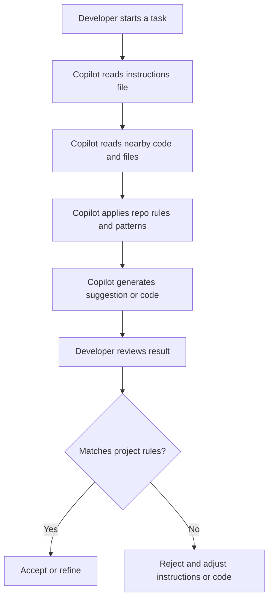
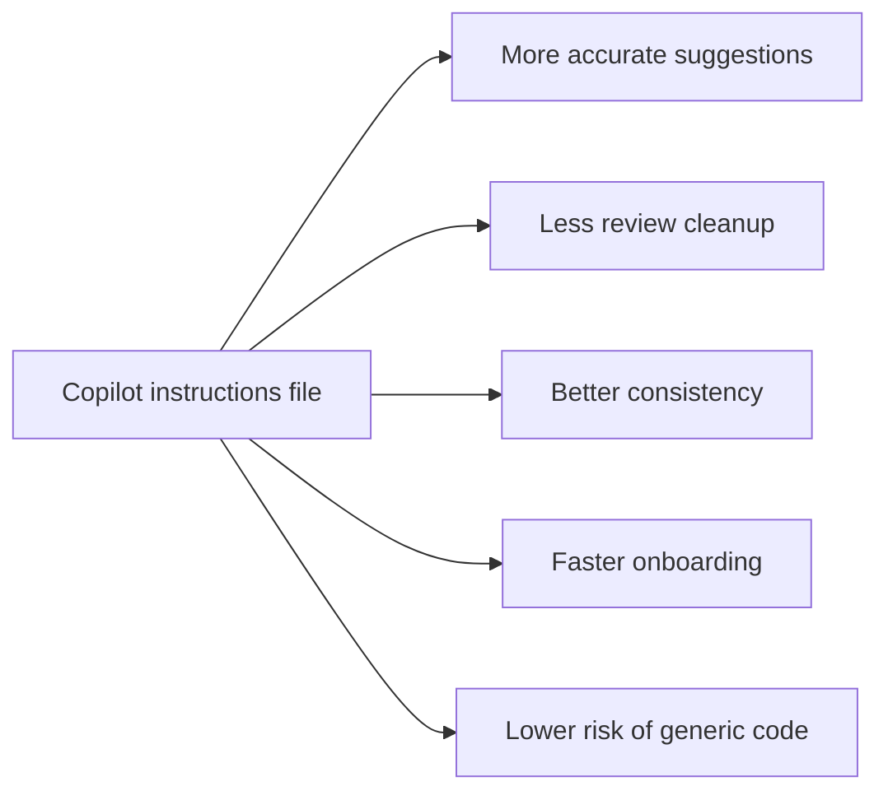
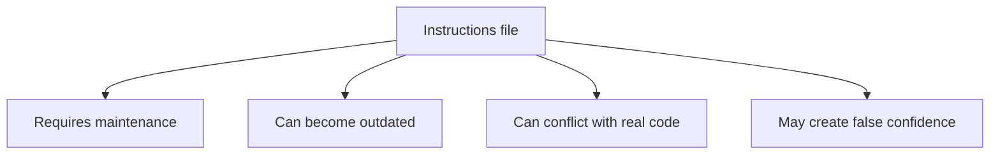
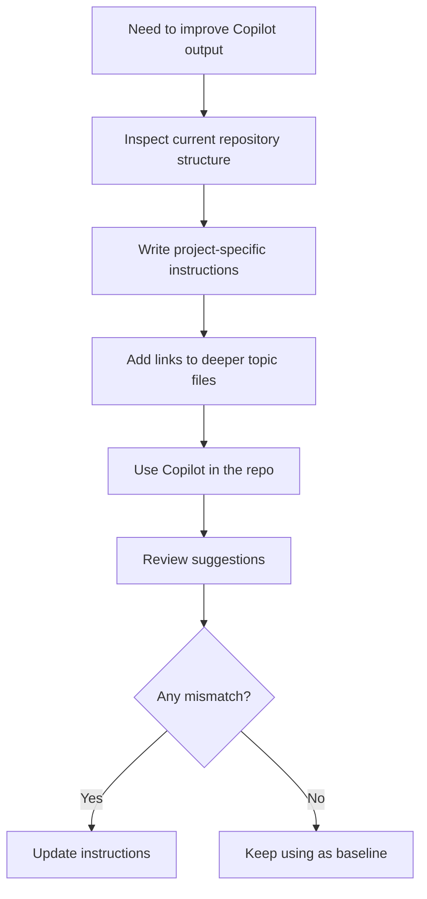

# Copilot Instructions File Guide

This document explains what a Copilot instructions file is, why it matters, how to use it, and its tradeoffs.

## What It Is

A Copilot instructions file is a repository-level guidance file that tells GitHub Copilot how to behave inside a project.

It usually contains:

- Project context
- Coding standards
- Architecture rules
- Naming conventions
- Testing expectations
- Do-not-do rules

In this repo, the main example is `.github/copilot-instructions.md`.

## Why We Need It

Without instructions, Copilot makes generic guesses.

With instructions, Copilot can:

- Match the existing architecture
- Follow the team's conventions
- Reduce incorrect code suggestions
- Avoid repeated explanations from humans
- Produce output that is easier to review and merge

## How It Works

## How To Use It

1. Put project-wide rules in the instructions file.
2. Keep the content short and specific.
3. Describe what the project actually does, not what a template assumes.
4. Point to deeper topic files when needed.
5. Update the file when project conventions change.

### Good Content

- Root package and module layout
- Framework and language versions
- Layer responsibilities
- API and exception conventions
- Testing expectations
- Security, logging, and validation rules

### Bad Content

- Vague advice like "write clean code"
- Rules that do not match the codebase
- Long policy text that duplicates general best practices
- Conflicting instructions across files

## Benefits

- Better alignment with real project structure
- Faster output review
- Less back-and-forth with Copilot
- More consistent code generation across contributors
- Easier onboarding for new developers and agents

## Disadvantages

- It needs regular updates.
- Wrong instructions can mislead Copilot.
- Overly broad instructions can reduce usefulness.
- It adds another project artifact to maintain.

## Limitations

- Copilot still can misunderstand context outside the file.
- It cannot replace code review.
- It cannot guarantee correct architecture or logic.
- It works best when the repo structure is already consistent.
- It is less effective if the instructions are generic or stale.

## Practical Flow

## Best Practices

- Keep the file focused on repository-specific rules.
- Use short sections and direct language.
- Split detailed rules into linked topic files.
- Review the file after major architecture changes.
- Treat the file as living documentation, not a one-time setup.

## Summary

A Copilot instructions file is useful because it turns Copilot from a generic assistant into a repo-aware assistant.

It is most valuable when the project has clear conventions and you want Copilot to follow them consistently.

Its main weakness is maintenance: the file must stay accurate, or it becomes a source of bad guidance instead of good guidance.
